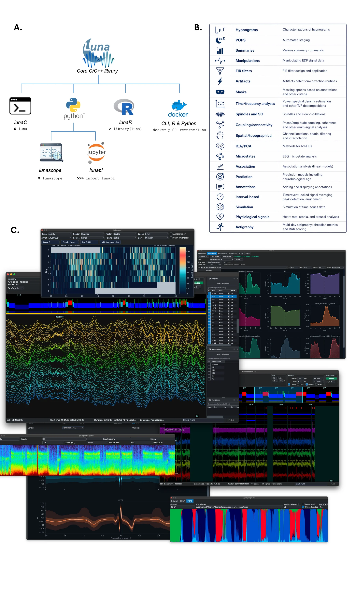

# Luna

 [](https://www.gnu.org/licenses/gpl-3.0)

**Luna is the core C/C++ analysis engine of the Luna sleep research ecosystem.** It provides command-line and embeddable tooling for large-scale analysis of EDF/EDF+ polysomnography data, annotation handling, signal processing, sleep staging, spectral analysis, cohort summaries, and derived-model workflows.



Luna is designed for reproducible sleep research workflows that need to scale from a single recording to large cohorts while preserving a common analytical core across command-line, C++ embedding, Python, and interactive desktop review.

## Technical report

For a higher-level overview of how Luna fits together with `lunapi` and Lunascope, see the technical report, [*The Luna ecosystem: integrated tools for sleep signal visualization and analysis*](https://doi.org/10.5281/zenodo.20025864). It describes the broader Luna ecosystem and the shared workflow spanning scripted and graphical analysis.

## What Luna provides

- Native C/C++ tooling for EDF/EDF+, annotations, masking, restructuring, and batch execution
- A broad command set for spectral analysis, spindle and slow-wave detection, connectivity, artifact handling, actigraphy, staging, and predictive models
- A reusable static/shared library (`libluna.a`, `libluna.dylib`, `libluna.so`) for embedding Luna in other applications
- A command-line executable (`luna`) for scripted and cohort-scale processing
- Shared analytical infrastructure used by `lunapi` and Lunascope

## Ecosystem

Luna is one part of a larger stack. The same analytical engine is exposed through multiple interfaces depending on the workflow:

| Project | Role | Repository | Web documentation |
|---|---|---|---|
| `luna-base` | Core C/C++ engine and CLI | https://github.com/remnrem/luna-base | https://zzz.nyspi.org/luna/ |
| `lunapi` | Python interface for notebooks and scripted workflows | https://github.com/remnrem/luna-api | https://zzz.nyspi.org/luna/python/ |
| `Lunascope` | Interactive desktop application for visualization, annotation, and review | https://github.com/Lorcan7274/lunascope | https://zzz.nyspi.org/luna/lunascope/ |

## Building from source

The top-level `Makefile` builds the main CLI plus library targets. Typical outputs are `luna`, `libluna.a`, and on supported platforms a shared library.

### Requirements

- C++17-capable compiler
- `fftw3`
- `zlib`
- optionally `LightGBM` if building with `LGBM=1`

### Common builds

```bash
# Linux
make -j$(nproc) ARCH=LINUX

# macOS
make -j$(sysctl -n hw.logicalcpu) ARCH=MAC
```

To build the embeddable library only:

```bash
# Linux
make -j$(nproc) ARCH=LINUX libluna

# macOS
make -j$(sysctl -n hw.logicalcpu) ARCH=MAC libluna
```

If LightGBM is not installed, disable it explicitly:

```bash
make -j$(nproc) ARCH=LINUX LGBM=0
```

Additional build settings such as `FFTW`, `LGBM`, `PYBIND11_PATH`, compiler overrides, and platform-specific flags are controlled through `Makefile.inc`.

## Quick usage

### Command-line

Luna processes either a single EDF or a sample list plus one or more commands:

```bash
./luna sample.lst -o out.db -s 'EPOCH & PSD sig=C3 spectrum'
```

Useful built-in help:

```bash
./luna -h
./luna -h PSD
./luna -hs spindle
```

### C++ embedding

This repository also exposes Luna as a library for other C++ applications. The in-repo guide [LUNAPI_CPP.md](LUNAPI_CPP.md) covers:

- building `libluna`
- linking from your own project
- creating in-memory recordings
- evaluating Luna commands programmatically
- retrieving structured result tables

The public API entry points live under [`lunapi/`](lunapi).

## Documentation

This repository does not duplicate the full command reference. The main documentation site remains the canonical source for end-user and API documentation.

| Resource | URL |
|---|---|
| Main Luna documentation | https://zzz.nyspi.org/luna/ |
| Source/build notes | https://zzz.nyspi.org/luna/download/source/ |
| C/C++ API overview | https://zzz.nyspi.org/luna/ext/api/ |
| In-repo C++ embedding guide | [LUNAPI_CPP.md](LUNAPI_CPP.md) |
| Example command documentation in this repo | [ACTIG.md](ACTIG.md) |

## Related workflows

If you want a higher-level interface on top of the same engine:

- use `lunapi` for Python, notebooks, and cohort scripting
- use Lunascope for visual review, annotation editing, and exploratory inspection

Because all three tools share the same analytical core, it is practical to move between CLI, Python, and GUI workflows without rewriting analyses from scratch.

## Contributing

See [CONTRIBUTING.md](CONTRIBUTING.md) for bug reports, feature requests, and pull request guidance specific to this C++ codebase.
